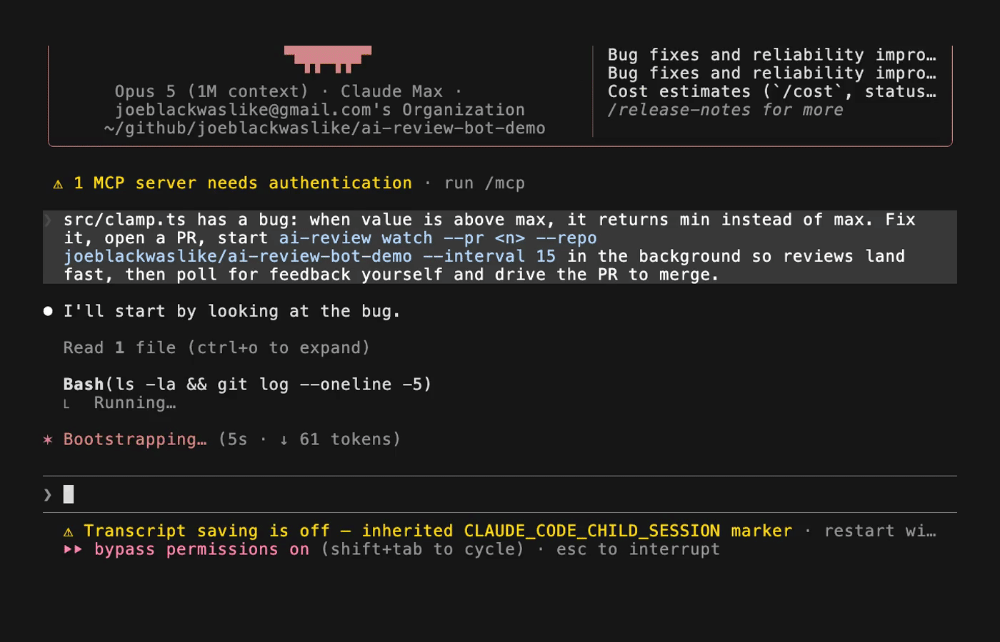
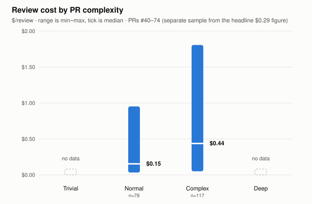

# ai-review-bot

[](https://github.com/joeblackwaslike/ai-review-bot/actions/workflows/ci.yml)
[](https://www.npmjs.com/package/ai-review-bot)
[](https://joeblackwaslike.github.io/ai-review-bot/)
[](LICENSE)
[](package.json)
[](https://vercel.com/joe-blacks-projects/ai-review-bot)
[](https://discord.gg/Fjc9zYHZyV)

**Rigorous review for autonomous agents. $0.29 a review.**



*Captured live from an actual autonomous Claude Code session driving a real
PR to a real merge — the actions are real, the narration wording was
formatted for the recording.*

**ai-review-bot** ships two parallel AI code reviewers in one Vercel deployment — a **Claude bot** (Anthropic) and a **Codex bot** (OpenAI). Each runs as its own GitHub App with its own icon, so you can tell them apart in your PR timeline. Both post independently; you get two expert opinions side by side on every review.

Both bots run **five specialized agents in parallel** — each focused on a different review framework — then merge their findings into a single deduplicated review comment.

> **[Full documentation →](https://joeblackwaslike.github.io/ai-review-bot/)**

## The old way

Your agent opens a PR, then goes idle. A human reviews it — 30 minutes,
sometimes longer — then has to remember to go tell the agent a review
landed, because the agent has no way to know on its own. The agent pushes a
fix, goes idle again. The human re-reviews, approves, tells it to merge.
Every round trip needs a human in the loop, and that's fine for one PR. It's
fatal once you're running more than one agent at a time.

## The new way

Two reviewers read every prior thread on the PR before commenting, to avoid
repeating a finding you've already seen. They aim to post only what's
genuinely new, with a priority and a fix block, directly as structured PR
comments. Your agent reads those comments itself and keeps going — no human
nudge required.

## Built for agents that ship PRs, not people who review them

If you've ever pointed a review agent at another agent's PR, you know the
quality bar is rough — real bugs, silently swallowed errors, missing test
coverage, security gaps. That's the gap ai-review-bot closes: two independent
reviewers (Claude + Codex) on every PR, so bad agent code gets caught before a
human ever has to look at it.

The real target isn't reviewing one PR faster — it's running a fleet of
agents overnight. I've done 8 PRs back-to-back while asleep, each one
driving itself through real review and real fixes, not a rubber-stamp.

Here's what that loop looks like in practice — the shape is real (this is the
exact narration format a driving agent uses), a representative run:

```
PR#812 opened, driving it to approval. Waiting for feedback.
Feedback for PR#812 received from anthropicreviewbot, fetching... CHANGES_REQUESTED. Triaging 1 of 2 findings...
Pushed commit #a3f9c21. Waiting for feedback.
Feedback for PR#812 received from anthropicreviewbot, fetching... APPROVED.
Feedback for PR#812 received from codexreviewbot, fetching... APPROVED.
PR#812 is Merged.
```

The demo GIF above shows a real, even faster example of the same loop — the
fix was clean enough that both bots approved on the first pass, no triage
round needed.

Run that loop N times in parallel, one per agent, one per PR — that's the
actual overnight workflow: not a single hero PR, a fleet of them, each held to
the same bar.

*(Still merging things yourself? The bots review just as well on a single PR —
install both GitHub Apps and every PR gets two independent opinions waiting
for you, no extra setup.)*

## Get started

- **[Try it on your own code, right now →](#cli--npm-package)** — `npx ai-review-bot review`, no setup, uses your existing Claude/Codex login, real review in your terminal in under a minute
- **[Install both GitHub Apps →](#quick-start)** — once you're sold, 2 minutes to get every PR reviewed automatically (works on public and private repos, see [Security](#security))
- **[Read the full docs →](https://joeblackwaslike.github.io/ai-review-bot/)**
- **[Join the Discord →](https://discord.gg/Fjc9zYHZyV)**

## Two bots, one deployment

| | Claude bot | Codex bot |
|---|---|---|
| **Provider** | Anthropic | OpenAI |
| **Models** | Haiku → Sonnet → Opus (by PR complexity) | GPT-5 → o4-mini → o3 (by PR complexity) |
| **Reasoning** | Extended thinking (`thinkingBudget`) | Reasoning effort (`low`/`medium`/`high`) |
| **Webhook** | `/api/github/webhook` | `/api/github/webhook-openai` |
| **Default prefix** | `ai-review-bot` | `codex-review-bot` |

Both bots share the same five review agents and the same slash command. Install both GitHub Apps on a repo and every `/ai-review` triggers two independent reviews — one from each provider.

## How it works

1. Comment `/ai-review` on any pull request
2. The bot fetches the diff and PR metadata from GitHub
3. **Five review agents run in parallel**, each applying one focused framework to the diff:
   - **Bug detection** (`pr-review-toolkit:code-reviewer`) — project-standard compliance, ≥80% confidence threshold
   - **Error handling** (`pr-review-toolkit:silent-failure-hunter`) — swallowed exceptions, empty catch blocks, silent fallbacks
   - **Test coverage** (`pr-review-toolkit:pr-test-analyzer`) — gaps on critical paths, criticality scoring 1–10
   - **Security** (`security-scanning:security-sast`) — injection, path traversal, XSS, hardcoded secrets
   - **Multi-axis quality** (`addyosmani:code-review-and-quality`) — correctness, readability, architecture, performance
4. The **merge layer** deduplicates findings (same `path:line` → one comment, more conservative finding wins), then emits a single verdict: `REQUEST_CHANGES` if any agent flagged a blocking issue, `COMMENT` otherwise
5. Inline comment anchors are validated against the actual diff before submission; invalid anchors are silently dropped
6. The structured review is posted to GitHub with inline comments, general findings, and a summary

## Architecture

```
webhook → buildReview()
              │
              ├── runAgent(code-reviewer)           ┐
              ├── runAgent(silent-failure-hunter)    │  Promise.allSettled()
              ├── runAgent(pr-test-analyzer)         │  (5 parallel API calls)
              ├── runAgent(security-sast)            │
              └── runAgent(code-review-and-quality)  ┘
                              │
                         mergeReviews()
                              │
                    ┌─────────┴──────────┐
               dedup by            verdict:
               path:line          REQUEST_CHANGES
               (conservative       if any agent
                wins)              flagged P0/P1
                              │
                     buildReviewComments()
                     (validate against diff)
                              │
                    POST to GitHub Reviews API
```

Model selection is automatic. The router classifies each PR into a tier based on size, file paths, and labels:

| Tier | Trigger | Claude | Codex |
|------|---------|--------|-------|
| `trivial` | Doc-only, <20 lines | Haiku | GPT-5 |
| `normal` | Standard PR | Sonnet | GPT-5 |
| `complex` | >500 lines or auth/crypto/db paths | Sonnet + thinking | o4-mini medium |
| `deep` | `deep-review` label | Opus + thinking | o3 high |

## When not to use this

- You need a single accountable human signoff for compliance/audit reasons —
  two bots are advisory, not a replacement.
- Your repo is sensitive and you're not comfortable sending diffs to
  Anthropic's/OpenAI's APIs — check your data-handling requirements first.
- You want zero false positives out of the box — LLM reviewers still restate
  or misfire occasionally; budget a few minutes to dismiss noise early on.

## Security

- Both bots authenticate as GitHub Apps, not PATs — least-privilege, scoped
  only to repos you install them on.
- Webhook payloads are verified via HMAC-SHA256 signature before any
  processing.
- API keys and GitHub App private keys live in Vercel env vars, never in the
  repo.
- Local CLI auth (`ai-review watch`/`review`/`audit`) is opt-in, personal-use
  only, and never wired into the webhook path (`src/auth.ts`).

## What does review actually cost?

Not a benchmark — run it on your own repo and get your own number:

```bash
./scripts/cost-report.sh owner/repo
```

It pulls every merged PR's bot reviews via `gh api`, parses the `$X.XX` each
bot prints in its own footer, and reports your real total/mean/median/min/max.
Not a fake 5-minute benchmark — the number is whatever your repo's real
history says.

On this repo (39 reviews across a recent PR run): **median $0.29/review**
($0.05–$1.64 range, pulled up by one unusually large PR — not a "deep" tier
sample in the classifier sense the chart below uses; that's a separate
window with its own tier breakdown).

Complexity tracks cost too — on a separate, broader sample (195 reviews
across PRs #40–74, not the same 39-review window as the headline figure
above, since it's classifying by tier rather than reproducing one exact
number): normal-tier PRs median $0.15 (n=78), complex-tier median $0.44
(n=117).



That's the trade being made:
[Faros AI's 2026 AI Engineering Report](https://www.faros.ai/blog/ai-acceleration-whiplash-takeaways)
found PRs merged with no review at all are up 31.3% and median time-in-review
is up 441.5% — *"reviewers cannot keep pace with the volume of AI-generated
code arriving for their attention."* Two bots at $0.29 a review is cheaper
than the alternative most teams are already living with.

Want the exact command that reproduces the $0.29 figure above?
`./scripts/cost-report.sh joeblackwaslike/ai-review-bot --prs 65,67-74`

## Quick start

See **[Quick Start →](https://joeblackwaslike.github.io/ai-review-bot/quick-start)** for the full setup guide. The short version:

1. Create a **Claude GitHub App** and a **Codex GitHub App** (or just one if you only want one provider)
2. Fork and deploy to Vercel, adding all env vars
3. Point each app's webhook at its respective endpoint
4. Install both apps on your repos
5. Comment `/ai-review` on a PR — you'll see two reviews appear

## Commands

```text
/ai-review                               # standard review (both bots)
/ai-review focus on security             # with extra instructions
/ai-review --force                       # re-review same commit
/ai-review --force check for regressions # force + extra instructions
```

Only comments from `OWNER`, `MEMBER`, and `COLLABORATOR` author associations trigger a review. Draft PRs are skipped automatically. Reviews are idempotent per SHA unless you pass `--force`.

## Environment variables

### Claude bot (Anthropic)

| Variable | Required | Description |
|---|---|---|
| `GITHUB_APP_ID` | ✓ | Numeric GitHub App ID |
| `GITHUB_APP_PRIVATE_KEY` | ✓ | PKCS#8 private key PEM (`\n` for newlines) |
| `GITHUB_WEBHOOK_SECRET` | ✓ | HMAC secret for webhook signature verification |
| `ANTHROPIC_API_KEY` | ✓ | Anthropic API key (`sk-ant-…`) |

### Codex bot (OpenAI)

| Variable | Required | Description |
|---|---|---|
| `OPENAI_APP_ID` | ✓ | Numeric GitHub App ID for the Codex app |
| `OPENAI_APP_PRIVATE_KEY` | ✓ | PKCS#8 private key PEM (`\n` for newlines) |
| `OPENAI_APP_WEBHOOK_SECRET` | ✓ | HMAC secret for the Codex app webhook |
| `OPENAI_API_KEY` | ✓ | OpenAI API key (`sk-…`) |

### Shared behavior

| Variable | Default | Description |
|---|---|---|
| `REVIEW_ENABLED` | `true` | Set to `false` to disable auto-review on PR open/push |
| `REVIEW_COMMAND` | `/ai-review` | Slash command that triggers both bots |
| `REVIEW_DELAY_SECONDS` | `450` | Seconds before auto-review fires on PR open (7.5 min) |
| `CUSTOM_REVIEW_PROMPT` | — | Extra instructions appended to every agent's system prompt |

See [Configuration →](https://joeblackwaslike.github.io/ai-review-bot/configuration) and [`.env.example`](.env.example).

## Development

```bash
npm install
npm run dev          # vercel dev (local server on :3000)
npm run typecheck    # tsc --noEmit
npm run lint         # biome check
npm run test         # vitest run
```

### Local webhook testing

```bash
# Terminal 1 — proxy for Claude bot
npx smee-client --url https://smee.io/<channel-1> \
  --target http://localhost:3000/api/github/webhook

# Terminal 2 — proxy for Codex bot
npx smee-client --url https://smee.io/<channel-2> \
  --target http://localhost:3000/api/github/webhook-openai

# Terminal 3 — local server
cp .env.example .env   # fill in your values
npm run dev
```

## CLI & npm package

`ai-review-bot` is also published to npm as a standalone CLI.

### Try it locally first

No GitHub App, no webhook, no PR needed — review your current working tree
with whatever `codex`/`claude` subscription or API key you already have:

```bash
npx ai-review-bot@latest review
```

Writes a Markdown report to `docs/code-reviews/` and prints a summary to your
terminal. Auth resolves in order: API key → OAuth env token → your logged-in
`codex`/`claude` CLI subscription (personal use only — see
[`src/auth.ts`](src/auth.ts)).

### Full-repo audit

The CLI can also audit an entire repository — no PR, no webhook, no Vercel
needed. It fetches all code files, runs the five agents in batches, and posts
findings as a GitHub issue.

```bash
# one-off, no install required
npx ai-review-bot@latest owner/repo

# or install globally
npm install -g ai-review-bot
ai-review owner/repo --ref main --dry-run
```

**Required env vars:** `GITHUB_APP_ID`, `GITHUB_APP_PRIVATE_KEY`, `ANTHROPIC_API_KEY`

> **[Full CLI documentation →](https://joeblackwaslike.github.io/ai-review-bot/cli-and-npm)**

## GitHub Action

Run a full-repo audit in any CI workflow — useful for scheduled weekly audits or auditing a repo from another workflow:

```yaml
- uses: joeblackwaslike/ai-review-bot@v0.1.0
  with:
    github-app-id: ${{ secrets.GITHUB_APP_ID }}
    github-app-private-key: ${{ secrets.GITHUB_APP_PRIVATE_KEY }}
    anthropic-api-key: ${{ secrets.ANTHROPIC_API_KEY }}
    # optional: repo, ref, dry-run, extra, version
```

See **[CLI & npm →](https://joeblackwaslike.github.io/ai-review-bot/cli-and-npm)** for all action inputs, a scheduled audit example, and the difference between PR reviews and full audits.

## Project structure

```
api/
  github/webhook.ts           # Claude bot webhook handler
  github/webhook-openai.ts    # Codex bot webhook handler
  health.ts                   # GET /api/health
  debug.ts                    # GET /api/debug
src/
  config.ts       # env var parsing — getConfig() and getOpenAIAppConfig()
  router.ts       # tier classification and model routing (both providers)
  models.ts       # model instantiation via Vercel AI SDK
  commands.ts     # slash command parsing, author association check
  github-app.ts   # Octokit setup, review submission + fallback retry
  prompt.ts       # buildUserMessage(), buildAgentSystemPrompt()
  review.ts       # agent layer, merge layer, diff anchor validation
  audit.ts        # full-repo audit for CLI / GitHub Action
  cli.ts          # npx ai-review entry point
  testing.ts      # test fixtures
skills/
  code-reviewer.md
  silent-failure-hunter.md
  pr-test-analyzer.md
  security-sast.md
  code-review-and-quality.md
```

## Roadmap

Fleet-scale autonomy raises the stakes on guardrails — some of that already
ships: `ai-review watch`'s circuit breaker (stops itself after 3 reviews in 15
minutes) and head-SHA staleness checks that no-op a superseded run. Coming
next: a full merge-autonomy runbook for driving PRs to merge unattended, with
a clear, documented stop condition for when a bot's findings genuinely can't
be resolved automatically instead of looping forever.

## Contributing

See [CONTRIBUTING.md](CONTRIBUTING.md).

## License

MIT — see [LICENSE](LICENSE).
